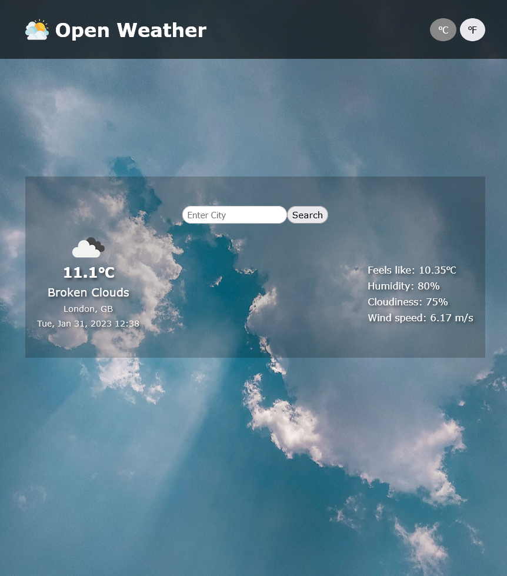
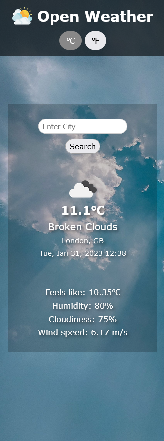

# Weather App

This is a solution to the [Weather App Project on The Odin Project](https://www.theodinproject.com/lessons/node-path-javascript-weather-app).
It is a simple weather app that fetches data from OpenWeatherMap API using async/await.

## Table of contents

- [Screenshot](#screenshot)
- [Link](#link)
- [Built with](#built-with)
- [What I learned](#what-i-learned)

### Screenshot

### Link

[Live Demo](https://www.mwiafeansong.github.io/weather-app)

### Built with

- Semantic HTML5 markup
- CSS custom properties
- Javascript
- Webpack

### What I learned

- Data retrieval from APIs using the fetch API and async/await
- Date and time formatting (with date-fns)
